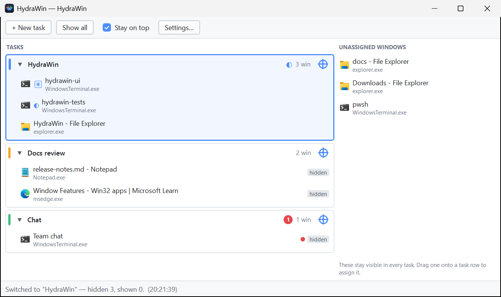
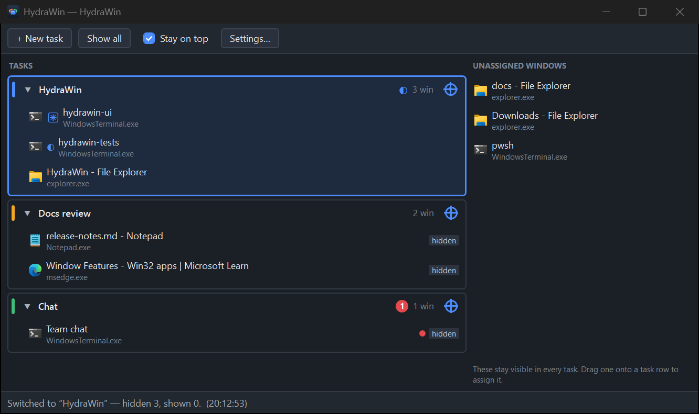

# HydraWin

**Task workspace manager for Windows 11: group your windows into tasks and switch between them by
hiding and restoring, not by virtual desktops.**

You work on several things at once, and each one is really a group of windows — a browser, a couple
of Claude Code terminals, an editor, maybe a chat client. HydraWin lets you name that group a
**task**. Switching to a task hides every *other* task's windows outright and restores this task's
windows exactly where they were.

Hidden means gone: no taskbar button, no Alt-Tab, nothing peeking from behind. Windows you have not
assigned to any task are never touched — they stay where they are in every task. And because a
window nobody can see is a window you cannot rescue by hand, **every hide is written to a journal on
disk before it happens**, so a crash, a power cut or a kill from Task Manager can always be undone.


## Requirements

- **Windows 11.** Everything in this repository was developed and measured on Windows 11 Pro
  10.0.26200.
- **.NET 10 SDK** to build it (`net10.0-windows`, C# 14).
- HydraWin runs **non-elevated by design**. A non-elevated process can never hide the windows of an
  elevated one (Windows blocks it via UIPI), so those windows are left out of the inventory
  entirely rather than listed and then refused.

## Build and run

```
git clone https://github.com/myuniquename/HydraWin.git
cd HydraWin
dotnet build HydraWin.sln
dotnet run --project src/HydraWin.App
```

To produce a standalone build:

```
dotnet publish src/HydraWin.App -c Release -r win-x64 --self-contained -p:PublishSingleFile=true
```

Note that this yields **six files, not one** — WPF's native components cannot be bundled into a
single file, so `D3DCompiler_47_cor3.dll`, `wpfgfx_cor3.dll`, `PresentationNative_cor3.dll`,
`PenImc_cor3.dll` and `vcruntime140_cor3.dll` sit beside `hydrawin.exe` and have to travel with it.

## Using it

1. Press **+ New task**. Name it whatever the work is called.
2. Drag a window from the **Unassigned windows** pane on the right onto the task row. For a window
   that will not drag — or one you would rather point at — press the blue **crosshair** on the task
   row and drag it over the window you want; it is outlined as you pass over it and joins the task
   when you let go.
3. Click a task row to switch to it. Everything belonging to the other tasks disappears; this
   task's windows come back where you left them.
4. **Show all** in the toolbar brings every hidden window back and leaves no task active.

Deleting a task un-hides its windows and returns them to Unassigned. **HydraWin never closes a
window** — not on delete, not on exit, not on a crash.

### Gestures

| Do this | To get this |
| --- | --- |
| Click a task row | Switch to that task |
| Double-click a task name | Rename it in place (`Enter` commits, `Esc` abandons) |
| Drag a task row | Reorder tasks — the order is what the number hotkeys address |
| Drag a window row onto a task | Assign the window to that task |
| Drag a window row to the right pane | Unassign it |
| Click the crosshair, then drag over the desktop | Grab any window on screen into that task |
| Right-click a window row | Focus · Unassign · Move to ▸ · Edit re-attach rule… |
| Right-click a task row | Switch to this task · Rename · Reset time · Delete · Delete and Close |
| `F2` | Rename the active task in place (`Enter` commits, `Esc` abandons) |
| `Del` | Delete the active task (its windows are un-hidden, never closed) |

**Delete** un-hides the task's windows and returns them to Unassigned; it never closes anything.
**Delete and Close** asks each of them to close first — the same request the title-bar × makes, with
no process ever force-quit — and deletes the task only if they all actually went. If any window
refuses, an unsaved-changes prompt being the usual reason, nothing is deleted and the row tells you
how many are left.

Rows tell you what is going on: a grey **hidden** chip means HydraWin currently has that window
hidden, and an orange **won't hide** chip means the hide was refused — the runtime safety net for a
window that turns out to be unmanageable.

### Hotkeys

These work from anywhere, whatever has focus:

| Key | Action |
| --- | --- |
| `Ctrl+Alt+1` … `Ctrl+Alt+9` | Switch to the task in that position and put focus inside it |
| `Ctrl+Alt+0` | Show all windows, leave no task active |
| `Ctrl+Alt+H` | Show or hide the HydraWin window |
| `Ctrl+Alt+Shift+R` | Panic restore — put every hidden window back, right now |

All four are rebindable in **Settings ▸ Hotkeys**. Panic restore is deliberately special: the
hotkeys run on a thread of their own and the restore happens inline on that thread, so it still
works when the user interface is wedged.

## Light and dark

HydraWin follows the Windows app theme, and follows it *live* — flip Windows between light and dark
and the window, its dialogs, its menus and its title bar change with it, no restart. If you would
rather pin one, **Settings ▸ General ▸ Appearance** offers *Follow Windows*, *Light* and *Dark*.

| Light | Dark |
| --- | --- |
|  |  |

A Windows high-contrast scheme overrides all three: HydraWin repaints in that scheme's own colours
rather than painting over an accessibility setting you chose deliberately.

One honest gap: the "delete this task?" confirmation is a Windows message box, so it stays light in
a dark theme. Nothing in the application can change that.

## Notifications

A hidden window can still ask for attention. Each task row carries a red badge counting the windows
inside it that are waiting to be looked at, and the window rows show which ones. Clicking the badge
switches to the task, focuses the window that asked most recently, and clears it.

The main signal is the taskbar flash (`HSHELL_FLASH`), which the shell raises for any application
without HydraWin needing to know anything about it — and which, importantly, is still delivered for
windows HydraWin has hidden. Looking at a window clears its badge; merely switching to the task does
not, because some applications (Teams, for one) flash only once per unread run and a badge cleared
on switch would lose the message for good.

Two optional extras, both off until you turn them on: **title rules** (a process filter plus a
regular expression, for programs that announce things in their title bar and never flash) and a tray
balloon per notification. Both live in **Settings ▸ Notifications**.

See [`docs/notifications/`](docs/notifications/README.md) for the measurements behind all of this.

## Claude Code

HydraWin was built by someone who keeps several Claude Code sessions running at once, and it knows a
little about them:

- **Live activity.** Claude Code writes a marker into its window title — a spinner `◐ ◑ ◒ ◓` while
  it is working, `✳` when it is idle. HydraWin parses it and shows the state on the task row, so you
  can see a session is still thinking even while its whole task is hidden.
- **Badging** goes through the terminal bell like any other application. For it to arrive, two
  settings outside HydraWin have to be right:
  - Windows Terminal's `bellStyle` must include `"taskbar"` (`"all"` works too). **`"taskbarFlash"`
    is not a valid value and is silently ignored** — a plausible-looking typo that produces no bell
    and no error.
  - Claude Code's `preferredNotifChannel` must be `terminal_bell`.
- **Expect a delay.** Claude Code rings that bell roughly **61 seconds after** a session goes idle,
  which is a property of Claude Code and not something HydraWin can shorten. The title marker
  updates immediately; the badge does not.

The exact settings and the measurements are in
[`docs/notifications/reference.md`](docs/notifications/reference.md).

## Your data on disk

Everything HydraWin keeps lives in `%APPDATA%\HydraWin\`. It writes **no registry key** — it reads
exactly one, the Windows app-theme preference, so that following your desktop's light or dark
setting works.

| File | What it holds |
| --- | --- |
| `state.json` | Your tasks, which windows belong to them, the re-attach rules and all settings |
| `journal.json` | The windows HydraWin has hidden *right now* — the crash-safety record |
| `logs\hydrawin.log` | Activity log, rolled once to `hydrawin.1.log` at 1 MB |

Both JSON files are written atomically and indented, and are meant to be readable and editable by
hand if you ever want to. Schemas are in
[`docs/workspaces/reference.md`](docs/workspaces/reference.md).

## If something goes wrong

Hiding windows is only safe if putting them back is guaranteed, so that is the part of HydraWin that
gets the most care:

- **Every hide is journaled first.** The entry is flushed to `journal.json` *before* the window is
  hidden, never after and never batched.
- **A normal launch repairs itself.** If the last run did not exit cleanly, HydraWin restores what
  the journal says is missing and tells you it did.
- **`hydrawin.exe --restore-all`** puts every hidden window back without starting the user
  interface at all — no window, no tray icon, not even the single-instance lock, so it works while a
  stuck instance is still running. It prints one line saying what it restored. This is the only
  command-line flag HydraWin has.
- **A crash restores before it dies.** The unhandled-exception handler logs the fault, brings your
  windows back, and then deliberately lets the process fall over rather than limping on.

The step-by-step drill is in [`docs/workspaces/how_to.md`](docs/workspaces/how_to.md).

## How it works

- **Documented Win32 only** — `ShowWindow` and `SetWindowPlacement`. The OS virtual-desktop COM
  interfaces were evaluated and rejected: they are undocumented and their GUIDs change with Windows
  feature updates, which would break the app on an ordinary Tuesday.
- **Journal before hide.** The write-ahead record is the contract that a crash can never permanently
  lose a window.
- **Re-attach rules, not handles.** A window handle means nothing after a restart, so each
  assignment stores a process image name plus a title pattern and the window rejoins its task when
  it — or HydraWin — comes back.
- **Unassigned windows are structurally safe.** The switch plan is computed from task assignments,
  so a window you never assigned simply is not in it. It is not a rule anyone has to remember.
- **Elevated windows are filtered out** rather than listed and marked, because a window HydraWin can
  never hide has no business being offered as something to put in a task.
- **No Win32 above `HydraWin.Core`.** Views bind, view models orchestrate, and every P/Invoke sits
  behind a small interface in `src/HydraWin.Core/Interop/`.

The reasoning behind each of these is argued in
[`docs/workspaces/architecture.md`](docs/workspaces/architecture.md) and
[`docs/ui/architecture.md`](docs/ui/architecture.md).

## Project layout

```
src/HydraWin.Core/          all the logic and every P/Invoke — no WPF, no packages
src/HydraWin.App/           the WPF shell: window, tray, hotkeys, dialogs
tests/HydraWin.Core.Tests/  xUnit tests over the pure logic
docs/                       the project's documentation
spikes/                     throwaway console apps used to measure Windows behaviour
```

## Documentation

**All of the project's documentation lives in the [`docs/`](docs/) folder.** This README is only the
front door; anything below the surface is written up there.

| Topic | Where |
| --- | --- |
| Window inventory, task model, switching, crash recovery | [`docs/workspaces/`](docs/workspaces/README.md) |
| How a hidden window asks for attention, and what it costs | [`docs/notifications/`](docs/notifications/README.md) |
| The shell: rows, gestures, tray, hotkeys, dialogs, theming, lifecycle | [`docs/ui/`](docs/ui/README.md) |

Each folder holds the same four files — `README.md` is the hub and its table says which of the
others answers your question, `architecture.md` explains how something works and why,
`how_to.md` holds recipes, and `reference.md` holds schemas and surfaces. Start at the `README.md`.

## Development

```
dotnet build HydraWin.sln
dotnet test --solution HydraWin.sln
dotnet format --verify-no-changes
```

A few things worth knowing before you open a pull request:

- **The `--solution` flag on `dotnet test` is required.** `global.json` puts the SDK into
  Microsoft.Testing.Platform mode, and a bare `dotnet test HydraWin.sln` is interpreted differently.
- **Warnings are errors**, and `SonarAnalyzer.CSharp` runs on every project — so an analyzer finding
  is a build failure. The repository carries **no suppressions at all**; please keep it that way and
  fix the finding instead.
- The tests cover `HydraWin.Core` — the matching rules, the journal, the model, badge aggregation.
  Win32-dependent behaviour has **no automated coverage by design**; it is verified by hand against
  throwaway windows using the drills in each `docs/*/how_to.md`.

## License

MIT — see [LICENSE.md](LICENSE.md).
